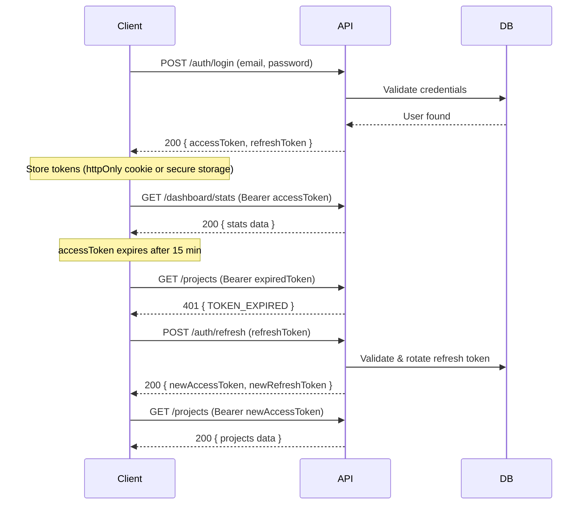

# WCAG Scanner — API Integration Specification

> Base URL: `http://localhost:8000/api/v2`
> All endpoints (except Auth) require a valid JWT Bearer token in the `Authorization` header.

---

## Table of Contents

1. [Authentication](#1-authentication)
2. [Dashboard](#2-dashboard)
3. [Projects](#3-projects)
4. [Scans](#4-scans)
5. [Issues](#5-issues)
6. [Reports](#6-reports)

---

## 1. Authentication

All auth endpoints are **public** (no Bearer token required).
Tokens are returned as a pair: a short-lived `accessToken` (15 min) and a long-lived `refreshToken` (7 days).

### 1.1 Register

```
POST /auth/register
```

**Request Body**
```json
{
  "name": "Pankaj Thakur",
  "email": "pankaj@example.com",
  "password": "StrongP@ss123"
}
```

**Response `201 Created`**
```json
{
  "success": true,
  "data": {
    "user": {
      "id": "usr_abc123",
      "name": "Pankaj Thakur",
      "email": "pankaj@example.com",
      "createdAt": "2025-01-15T10:00:00Z"
    },
    "accessToken": "eyJhbGciOiJIUzI1NiIs...",
    "refreshToken": "dGhpcyBpcyBhIHJlZnJl..."
  }
}
```

**Error `409 Conflict`**
```json
{
  "success": false,
  "error": { "code": "EMAIL_EXISTS", "message": "A user with this email already exists." }
}
```

---

### 1.2 Login

```
POST /auth/login
```

**Request Body**
```json
{
  "email": "pankaj@example.com",
  "password": "StrongP@ss123"
}
```

**Response `200 OK`**
```json
{
  "success": true,
  "data": {
    "user": {
      "id": "usr_abc123",
      "name": "Pankaj Thakur",
      "email": "pankaj@example.com"
    },
    "accessToken": "eyJhbGciOiJIUzI1NiIs...",
    "refreshToken": "dGhpcyBpcyBhIHJlZnJl..."
  }
}
```

**Error `401 Unauthorized`**
```json
{
  "success": false,
  "error": { "code": "INVALID_CREDENTIALS", "message": "Invalid email or password." }
}
```

---

### 1.3 Refresh Token

```
POST /auth/refresh
```

**Request Body**
```json
{
  "refreshToken": "dGhpcyBpcyBhIHJlZnJl..."
}
```

**Response `200 OK`**
```json
{
  "success": true,
  "data": {
    "accessToken": "eyJhbGciOiJIUzI1NiIs...(new)...",
    "refreshToken": "dGhpcyBpcyBhIG5ldyBy...(new, rotated)..."
  }
}
```

**Error `401 Unauthorized`**
```json
{
  "success": false,
  "error": { "code": "TOKEN_EXPIRED", "message": "Refresh token has expired. Please log in again." }
}
```

---

### 1.4 Logout

```
POST /auth/logout
```

**Headers**: `Authorization: Bearer <accessToken>`

**Request Body**
```json
{
  "refreshToken": "dGhpcyBpcyBhIHJlZnJl..."
}
```

**Response `200 OK`**
```json
{
  "success": true,
  "message": "Logged out successfully. Refresh token revoked."
}
```

---

### 1.5 Get Current User

```
GET /auth/me
```

**Headers**: `Authorization: Bearer <accessToken>`

**Response `200 OK`**
```json
{
  "success": true,
  "data": {
    "id": "usr_abc123",
    "name": "Pankaj Thakur",
    "email": "pankaj@example.com",
    "createdAt": "2025-01-15T10:00:00Z"
  }
}
```

---

## 2. Dashboard

### 2.1 Get Dashboard Stats

Used by the **Dashboard** page to populate the 4 stat cards and the compliance gauge.

```
GET /dashboard/stats
```

**Headers**: `Authorization: Bearer <accessToken>`

**Response `200 OK`**
```json
{
  "success": true,
  "data": {
    "totalScans": 42,
    "activeProjects": 3,
    "criticalIssues": 8,
    "avgScore": 78,
    "issuesByImpact": {
      "critical": 8,
      "serious": 15,
      "moderate": 22,
      "minor": 6
    }
  }
}
```

---

### 2.2 Get All Scanned Pages

Used by the **"All Scanned Pages"** table on the Dashboard.

```
GET /dashboard/pages?page=1&limit=20
```

**Headers**: `Authorization: Bearer <accessToken>`

**Query Params**
| Param   | Type   | Default | Description                    |
|---------|--------|---------|--------------------------------|
| `page`  | number | 1       | Page number for pagination     |
| `limit` | number | 20      | Number of results per page     |
| `sort`  | string | `-createdAt` | Sort field (prefix `-` for desc) |

**Response `200 OK`**
```json
{
  "success": true,
  "data": [
    {
      "id": "scan_001",
      "url": "https://example.com",
      "projectName": "Corporate Website",
      "score": 92,
      "issuesCount": 3,
      "lastScanned": "2025-01-15T10:00:00Z",
      "status": "completed"
    }
  ],
  "pagination": {
    "page": 1,
    "limit": 20,
    "totalPages": 3,
    "totalItems": 42
  }
}
```

---

## 3. Projects

### 3.1 List Projects

```
GET /projects?page=1&limit=10&status=active
```

**Headers**: `Authorization: Bearer <accessToken>`

**Query Params**
| Param    | Type   | Default | Description                        |
|----------|--------|---------|------------------------------------|
| `page`   | number | 1       | Page number                        |
| `limit`  | number | 10      | Results per page                   |
| `status` | string | —       | Filter: `active` or `archived`     |

**Response `200 OK`**
```json
{
  "success": true,
  "data": [
    {
      "id": "proj_001",
      "name": "Corporate Website",
      "url": "https://example.com",
      "description": "Main company website",
      "status": "active",
      "score": 92,
      "lastScan": "2025-01-15T10:00:00Z",
      "createdAt": "2024-06-01T08:00:00Z"
    }
  ],
  "pagination": {
    "page": 1,
    "limit": 10,
    "totalPages": 1,
    "totalItems": 4
  }
}
```

---

### 3.2 Get Single Project

```
GET /projects/:projectId
```

**Headers**: `Authorization: Bearer <accessToken>`

**Response `200 OK`**
```json
{
  "success": true,
  "data": {
    "id": "proj_001",
    "name": "Corporate Website",
    "url": "https://example.com",
    "description": "Main company website",
    "status": "active",
    "score": 92,
    "lastScan": "2025-01-15T10:00:00Z",
    "scanCount": 12,
    "createdAt": "2024-06-01T08:00:00Z",
    "updatedAt": "2025-01-15T10:00:00Z"
  }
}
```

---

### 3.3 Create Project

```
POST /projects
```

**Headers**: `Authorization: Bearer <accessToken>`

**Request Body**
```json
{
  "name": "New Website",
  "url": "https://newsite.com",
  "description": "Optional project description"
}
```

**Response `201 Created`**
```json
{
  "success": true,
  "data": {
    "id": "proj_005",
    "name": "New Website",
    "url": "https://newsite.com",
    "description": "Optional project description",
    "status": "active",
    "score": null,
    "lastScan": null,
    "createdAt": "2025-01-16T12:00:00Z"
  }
}
```

**Error `400 Bad Request`**
```json
{
  "success": false,
  "error": { "code": "VALIDATION_ERROR", "message": "URL is required and must be a valid URL." }
}
```

---

### 3.4 Update Project

```
PUT /projects/:projectId
```

**Headers**: `Authorization: Bearer <accessToken>`

**Request Body**
```json
{
  "name": "Updated Name",
  "url": "https://updated-url.com",
  "description": "Updated description",
  "status": "archived"
}
```

**Response `200 OK`**
```json
{
  "success": true,
  "data": {
    "id": "proj_001",
    "name": "Updated Name",
    "url": "https://updated-url.com",
    "status": "archived",
    "updatedAt": "2025-01-16T14:00:00Z"
  }
}
```

---

### 3.5 Delete Project

```
DELETE /projects/:projectId
```

**Headers**: `Authorization: Bearer <accessToken>`

**Response `200 OK`**
```json
{
  "success": true,
  "message": "Project deleted successfully."
}
```

---

## 4. Scans

### 4.1 Start Quick Scan

Used by the **"Quick Scan" tab** on the Scan page.

```
POST /scans/quick
```

**Headers**: `Authorization: Bearer <accessToken>`

**Request Body**
```json
{
  "url": "https://example.com",
  "siteWide": false,
  "maxPages": 10,
  "maxDepth": 3,
  "scanners": ["axe-core"]
}
```

**Response `202 Accepted`**
```json
{
  "success": true,
  "data": {
    "scanId": "scan_new_001",
    "url": "https://example.com",
    "type": "quick",
    "status": "queued",
    "createdAt": "2025-01-16T12:30:00Z"
  },
  "message": "Scan has been queued and will begin shortly."
}
```

---

### 4.2 Start Project Scan

Used by the **"Project Scan" tab** on the Scan page.

```
POST /scans/project
```

**Headers**: `Authorization: Bearer <accessToken>`

**Request Body**
```json
{
  "projectId": "proj_001",
  "maxPages": 50,
  "maxDepth": 5,
  "scanners": ["axe-core", "html-validator"]
}
```

**Response `202 Accepted`**
```json
{
  "success": true,
  "data": {
    "scanId": "scan_new_002",
    "projectId": "proj_001",
    "url": "https://example.com",
    "type": "full",
    "status": "queued",
    "createdAt": "2025-01-16T12:35:00Z"
  },
  "message": "Project scan has been queued."
}
```

---

### 4.3 Get Scan Status / Progress

Used by the **progress bar** on the Scan page to poll real-time status.

```
GET /scans/:scanId/status
```

**Headers**: `Authorization: Bearer <accessToken>`

**Response `200 OK` (In Progress)**
```json
{
  "success": true,
  "data": {
    "scanId": "scan_new_001",
    "status": "scanning",
    "progress": 65,
    "pagesScanned": 7,
    "totalPages": 10,
    "currentUrl": "https://example.com/about",
    "startedAt": "2025-01-16T12:30:05Z"
  }
}
```

**Response `200 OK` (Completed)**
```json
{
  "success": true,
  "data": {
    "scanId": "scan_new_001",
    "status": "completed",
    "progress": 100,
    "pagesScanned": 10,
    "totalPages": 10,
    "score": 85,
    "issuesCount": 7,
    "duration": 45,
    "completedAt": "2025-01-16T12:30:50Z"
  }
}
```

---

### 4.4 List Scans

Used by the **Dashboard "All Scanned Pages"** table and the **Reports** page.

```
GET /scans?page=1&limit=20&projectId=proj_001&status=completed
```

**Headers**: `Authorization: Bearer <accessToken>`

**Query Params**
| Param       | Type   | Default      | Description                              |
|-------------|--------|--------------|------------------------------------------|
| `page`      | number | 1            | Page number                              |
| `limit`     | number | 20           | Results per page                         |
| `projectId` | string | —            | Filter by project                        |
| `status`    | string | —            | Filter: `queued`, `scanning`, `completed`, `failed` |
| `sort`      | string | `-createdAt` | Sort field                               |

**Response `200 OK`**
```json
{
  "success": true,
  "data": [
    {
      "id": "scan_001",
      "projectId": "proj_001",
      "projectName": "Corporate Website",
      "url": "https://example.com",
      "type": "full",
      "status": "completed",
      "score": 92,
      "issuesCount": 3,
      "duration": 45,
      "createdAt": "2025-01-15T10:00:00Z"
    }
  ],
  "pagination": {
    "page": 1,
    "limit": 20,
    "totalPages": 3,
    "totalItems": 42
  }
}
```

---

### 4.5 Get Single Scan Detail

```
GET /scans/:scanId
```

**Headers**: `Authorization: Bearer <accessToken>`

**Response `200 OK`**
```json
{
  "success": true,
  "data": {
    "id": "scan_001",
    "projectId": "proj_001",
    "projectName": "Corporate Website",
    "url": "https://example.com",
    "type": "full",
    "status": "completed",
    "score": 92,
    "issuesCount": 3,
    "duration": 45,
    "pagesScanned": 10,
    "scanners": ["axe-core"],
    "createdAt": "2025-01-15T10:00:00Z",
    "completedAt": "2025-01-15T10:00:45Z"
  }
}
```

---

## 5. Issues

### 5.1 List Issues for a Scan

Used by the **Issues** page after selecting a report from the dropdown.

```
GET /scans/:scanId/issues?page=1&limit=20&impact=critical&status=open
```

**Headers**: `Authorization: Bearer <accessToken>`

**Query Params**
| Param    | Type   | Default | Description                                       |
|----------|--------|---------|---------------------------------------------------|
| `page`   | number | 1       | Page number                                       |
| `limit`  | number | 20      | Results per page                                  |
| `impact` | string | —       | Filter: `critical`, `serious`, `moderate`, `minor` |
| `status` | string | —       | Filter: `open`, `fixed`, `ignored`                 |

**Response `200 OK`**
```json
{
  "success": true,
  "data": [
    {
      "id": "issue_001",
      "scanId": "scan_001",
      "description": "Images must have alternate text",
      "impact": "critical",
      "wcagCriteria": "1.1.1",
      "wcagLevel": "A",
      "selector": "img.hero-banner",
      "htmlSnippet": "",
      "howToFix": "Add an alt attribute with descriptive text to the image.",
      "helpUrl": "https://dequeuniversity.com/rules/axe/4.4/image-alt",
      "status": "open",
      "pageUrl": "https://example.com"
    }
  ],
  "pagination": {
    "page": 1,
    "limit": 20,
    "totalPages": 1,
    "totalItems": 3
  }
}
```

---

### 5.2 Update Issue Status

Used to mark an issue as `fixed` or `ignored`.

```
PATCH /issues/:issueId
```

**Headers**: `Authorization: Bearer <accessToken>`

**Request Body**
```json
{
  "status": "fixed"
}
```

**Response `200 OK`**
```json
{
  "success": true,
  "data": {
    "id": "issue_001",
    "status": "fixed",
    "updatedAt": "2025-01-16T15:00:00Z"
  }
}
```

---

## 6. Reports

### 6.1 List Reports (Completed Scans)

Used by the **Reports** page table and the **Issues** page "Select Report" dropdown.

```
GET /reports?page=1&limit=20
```

**Headers**: `Authorization: Bearer <accessToken>`

**Query Params**
| Param       | Type   | Default      | Description            |
|-------------|--------|--------------|------------------------|
| `page`      | number | 1            | Page number            |
| `limit`     | number | 20           | Results per page       |
| `projectId` | string | —            | Filter by project      |
| `sort`      | string | `-createdAt` | Sort field             |

**Response `200 OK`**
```json
{
  "success": true,
  "data": [
    {
      "id": "report_001",
      "scanId": "scan_001",
      "projectId": "proj_001",
      "projectName": "Corporate Website",
      "url": "https://example.com",
      "type": "full",
      "score": 92,
      "issuesCount": 3,
      "status": "completed",
      "createdAt": "2025-01-15T10:00:00Z"
    }
  ],
  "pagination": {
    "page": 1,
    "limit": 20,
    "totalPages": 2,
    "totalItems": 25
  }
}
```

---

### 6.2 Download Report (HTML)

```
GET /reports/:reportId/download?format=html
```

**Headers**: `Authorization: Bearer <accessToken>`

**Query Params**
| Param    | Type   | Required | Options               |
|----------|--------|----------|-----------------------|
| `format` | string | Yes      | `html`, `json`, `csv` |

**Response `200 OK`**
- **`format=html`**: Returns `Content-Type: text/html` with the full HTML report as file download.
- **`format=json`**: Returns `Content-Type: application/json` with the structured report data.
- **`format=csv`**: Returns `Content-Type: text/csv` with issues as a CSV file.

**Response Headers (all formats)**
```
Content-Disposition: attachment; filename="report_001_2025-01-15.html"
```

**JSON format Response Body**
```json
{
  "success": true,
  "data": {
    "reportId": "report_001",
    "url": "https://example.com",
    "score": 92,
    "generatedAt": "2025-01-15T10:01:00Z",
    "summary": {
      "critical": 0,
      "serious": 1,
      "moderate": 1,
      "minor": 1,
      "totalIssues": 3,
      "totalPagesScanned": 10
    },
    "issues": [
      {
        "id": "issue_001",
        "description": "Images must have alternate text",
        "impact": "critical",
        "wcagCriteria": "1.1.1",
        "selector": "img.hero-banner",
        "howToFix": "Add an alt attribute.",
        "pageUrl": "https://example.com"
      }
    ]
  }
}
```

---

## Common Patterns

### Authentication Header

All protected endpoints require:
```
Authorization: Bearer <accessToken>
```

### Token Lifecycle



### Standard Error Response

All error responses follow this structure:
```json
{
  "success": false,
  "error": {
    "code": "ERROR_CODE",
    "message": "Human-readable error description."
  }
}
```

| HTTP Code | Error Code           | Scenario                         |
|-----------|----------------------|----------------------------------|
| 400       | VALIDATION_ERROR     | Invalid request body/params      |
| 401       | INVALID_CREDENTIALS  | Wrong email/password             |
| 401       | TOKEN_EXPIRED        | Access or refresh token expired  |
| 401       | TOKEN_INVALID        | Malformed or tampered token      |
| 403       | FORBIDDEN            | User lacks permission            |
| 404       | NOT_FOUND            | Resource does not exist          |
| 409       | EMAIL_EXISTS         | Duplicate registration           |
| 429       | RATE_LIMITED         | Too many requests                |
| 500       | INTERNAL_ERROR       | Unexpected server error          |

### Frontend → API Page Mapping

| Frontend Page  | API Endpoints Used                                        |
|----------------|-----------------------------------------------------------|
| `/login`       | `POST /auth/login`, `POST /auth/register`                 |
| `/` (Dashboard)| `GET /dashboard/stats`, `GET /dashboard/pages`            |
| `/projects`    | `GET /projects`, `POST /projects`, `PUT /projects/:id`, `DELETE /projects/:id` |
| `/scan`        | `POST /scans/quick`, `POST /scans/project`, `GET /scans/:id/status`, `GET /projects` |
| `/issues`      | `GET /reports` (dropdown), `GET /scans/:id/issues`, `PATCH /issues/:id` |
| `/reports`     | `GET /reports`, `GET /reports/:id/download?format=html\|json\|csv` |
| All pages      | `POST /auth/refresh` (interceptor), `POST /auth/logout`  |
